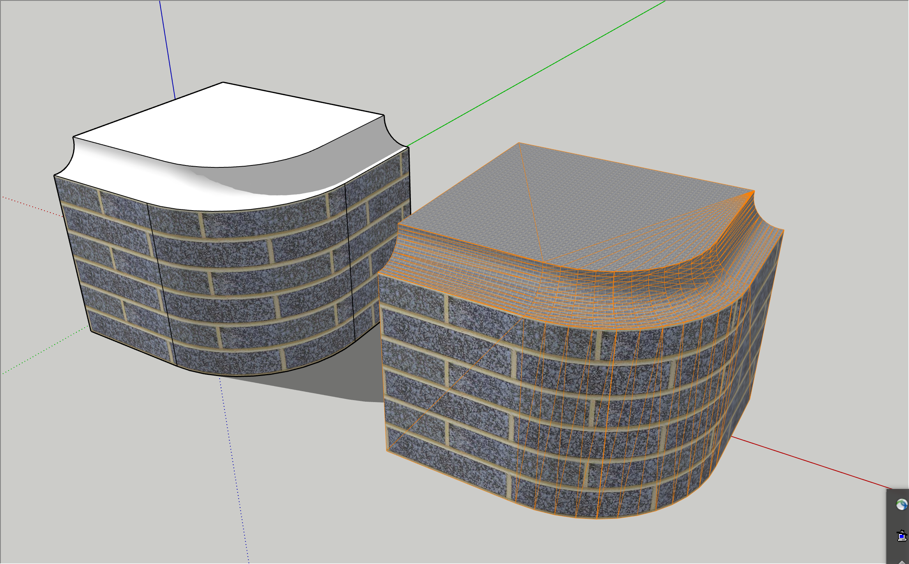

# Example Drawing Shaded and Textured Polygons

This example project demonstrates how to draw shaded and textured polygons to the viewport from a custom Ruby tool.

This requires SketchUp 2020.0 or newer.

